# AWS ETL

- [1 Set up AWS ETL components](#1-set-up-aws-etl-components)
- [2. Review AWS ETL project structure](#2-review-aws-etl-project-structure)

This README contains both general data (how I installed, set up AWS components, what problems did I have)
and the description of my ETL pipeline.

This project is a sample ETL implementation based on AWS S3, Lambda, Redshift, Cloudwatch, Step Function.
It ingests a dataset from source S3 catalog, validates/filters/transforms it,
and loads to Redshift both raw and transformed data. 
This process is automated with Step Function and monitored with CloudWatch schedulers and metrics.

More details about each of the components:
- s3 bucket is a source of raw data.
- redshift has 2 separate tables for both raw and transformed data
- lambda function, which belongs to s3-trigger, reacts to any newly added csv-file to s3 catalog and:
  - sends raw data just to redshift ```raw``` table
  - cleans and transforms raw data
  - sends transformed data to radshift ```transformed``` table
- lambda function is also wrapped into a step-function
- cloudwatch with special schedulers schedules execution of step-function and collects metrics from it.
- cloudwatch raises alarm (or OK) based on metric rules.


## 1. Set up AWS ETL components
1. AWS account creation:

I used my existing account


2. create s3 catalog, upload there split ```AB_NYC_2019.csv``` file under ```raw/``` key:

   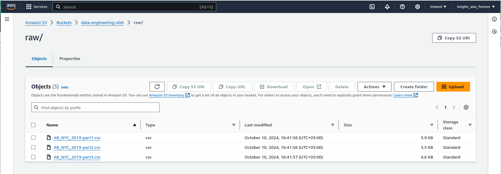


3. in AWS console, create redshift workgroup, cluster, database, set up user (in my case - admin with authorization by password). 
In SQL query editor, create 2 tables: ```raw``` and ```transformed```. The commands for them can be found in ```redshift_queries.sql``` script.
```
IMPORTANT: 
for raw table all the columns are NULLABLE
 since we store there not yet cleared and transformed data.
 
for transformed table critical columns are already NOT NULL.
this means, invalid data with empty critical fields cannot 
even be inserted into transformed table,
and lambda trigger will fail.

```

   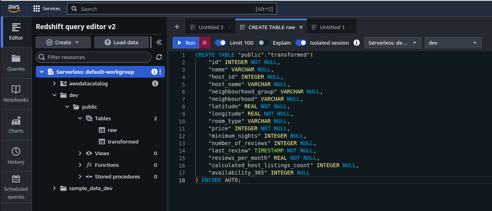

my configs for Redshift:
   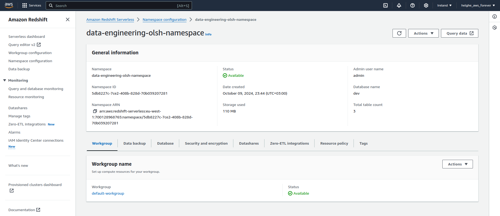


4. Create a policy and role for your future Lambda function. It should have access to redshift, s3, 
```
IMPORTANT:
since it's a sample ETL, the permissions given to policy are quite wide.
AWS promotes best practices to grant only the permissions required to perform a task.
On production, when the infrastructure is huge and account can be shared between multiple teams/projects,
it's better to review resource list and given permissions (set names of s3 buckets, redshift instances, etc).
```
policy:
   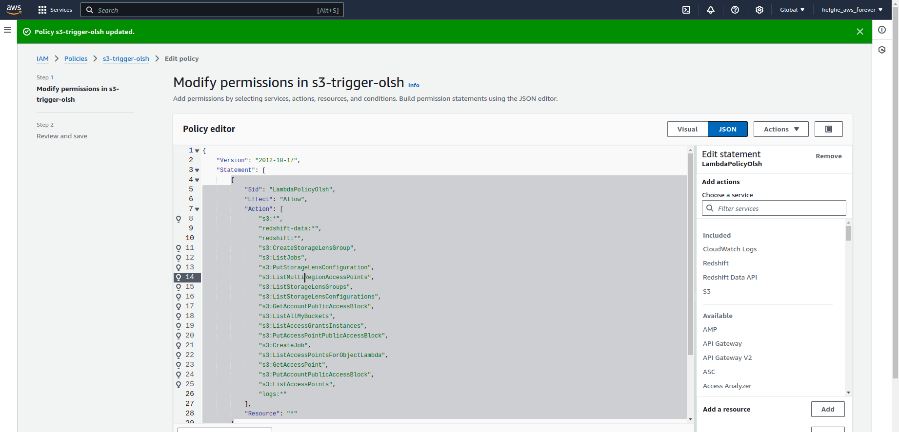

role:
   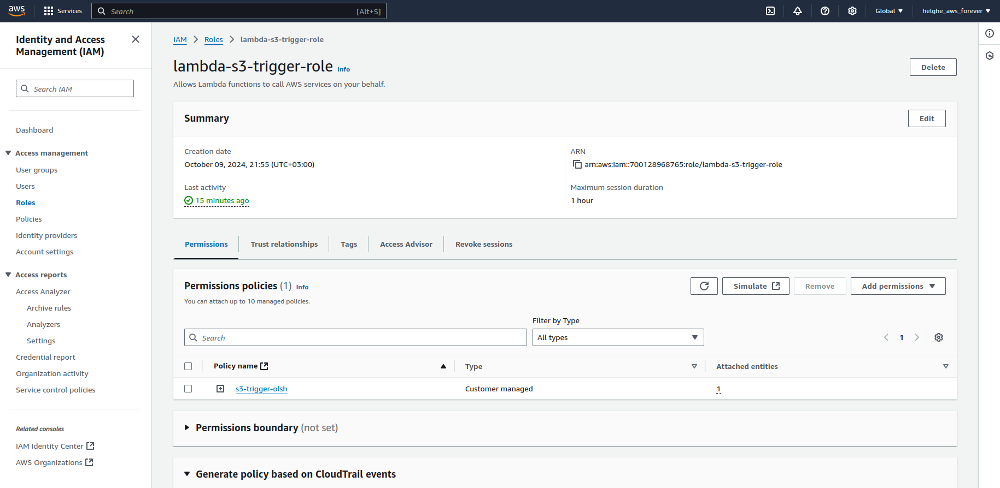


5. Create lambda function to trigger on each new file add:
- code can be found in file ```lambda_function.py```
- it has already all the configs for s3 (catalog name, path to files) and to redshift database (host/port/db name/username/password, etc) for creating connection and loading data.

```
IMPORTANT:
default execution timeout for lambda is just 3 sec, 
so it may be not enough and so should be increased in "General Configuration" tab.
```

  - use the role which was previously created
  - after text is inserted, ```deploy``` it and ```test``` (with custom event).
  this is the sample event for testing our lambda:


    ```
    {
      "Records": [
        {
            "eventVersion": "2.0",
            "eventSource": "aws:s3",
            "awsRegion": "eu-west-1",
            "eventTime": "1970-01-01T00:00:00.000Z",
            "eventName": "ObjectCreated:Put",
            "userIdentity": {
                "principalId": "EXAMPLE"
            },
            "requestParameters": {
                "sourceIPAddress": "127.0.0.1"
            },
            "responseElements": {
                "x-amz-request-id": "EXAMPLE123456789",
                "x-amz-id-2": "EXAMPLE123/5678abcdefghijklambdaisawesome/mnopqrstuvwxyzABCDEFGH"
            },
            "s3": {
                "s3SchemaVersion": "1.0",
                "configurationId": "testConfigRule",
                "bucket": {
                    "name": "data-engineering-olsh",
                    "ownerIdentity": {
                    "principalId": "EXAMPLE"
                    },
                "arn": "arn:aws:s3:::data-engineering-olsh"
                },
            "object": {
                "key": "raw/AB_NYC_2019.csv",
                "size": 1024,
                "eTag": "0123456789abcdef0123456789abcdef",
                "sequencer": "0A1B2C3D4E5F678901"
                }
            }
        }
    ]
    }
    ```
   
    - add also trigger for s3:
      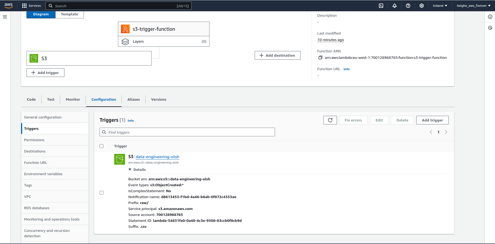


```
IMPORTANT:

this python script for lambda function has dependencies for some libraries 
(e.g. psycopg2 for connecting to postgres, pandas for handling dataframe, etc).
they are not installed out-of-the-box,
so need to be downloaded locally and uploaded with "upload from" to AWS
or using lambda layer (better for the futher reusing).
```


6. create step function from the lambda function.
For example, my step function has 3 tasks: monitor new data in s3, load and transfrom it in lambda, and review it in redshift:

   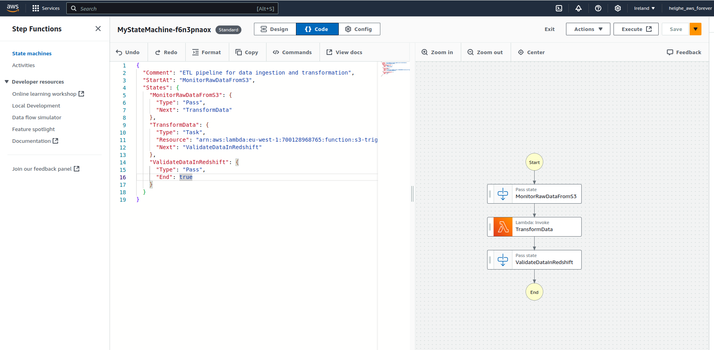


7. create CloudWatch scheduler which will run step function at some fixed schedule (cron or rate):
   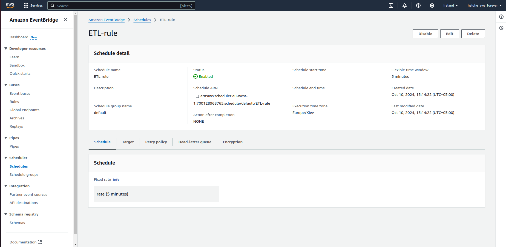

After it's ready, after some time, we can see some executions:
   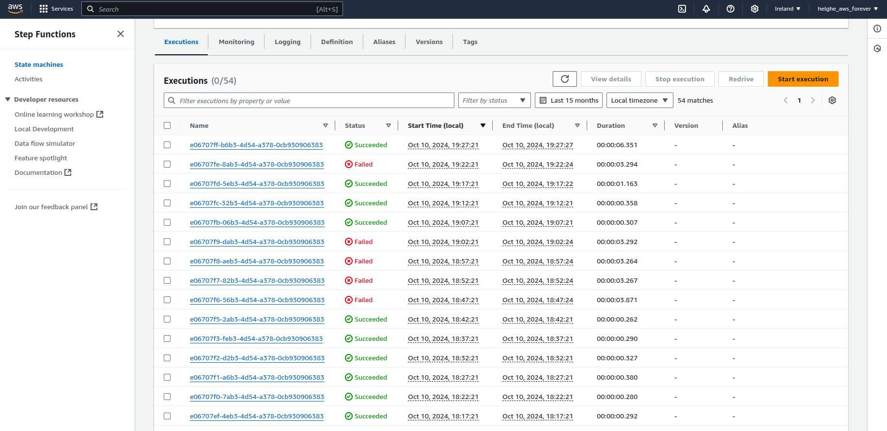


8. create metrics and alarms in CloudWatch to monitor executions and receive alarms. I created 2 alarms:
    - to monitor retries in lambda executions
    - to track failed executions for lambda function
   they both send notifications to SNS topic and to mail address in case of threshold exceeding 
   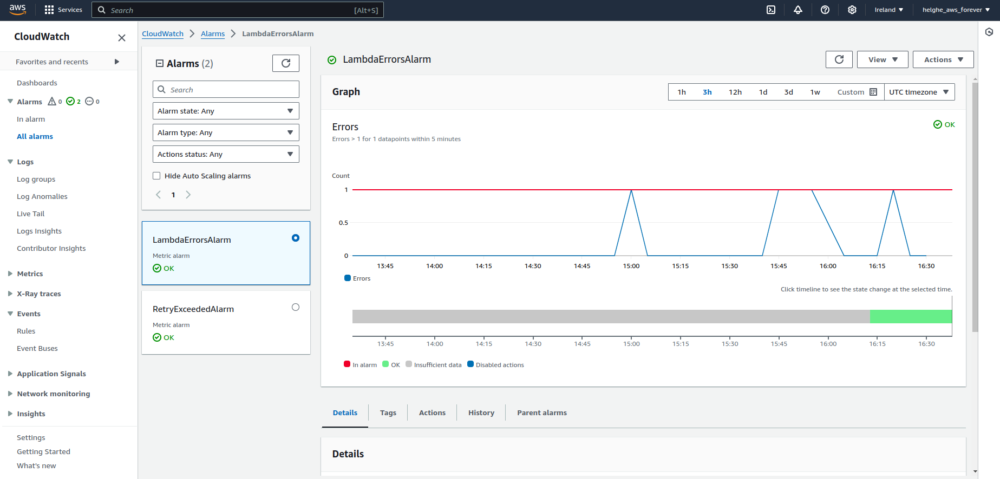


## 2. Review AWS ETL project structure:
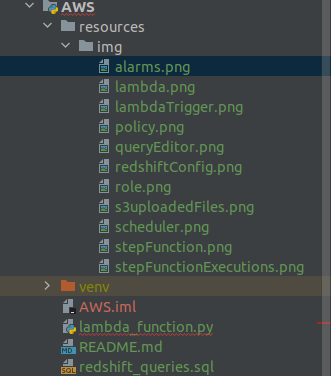
##### lambda_function.py
the whole lamba script which is responsible for handling incoming events, loading them to RAW table, transforming/cleaning, and loading to TRANSFORMED table
##### redshift_queries.sql
sql script for creating tables in Redshift and additional query to validate TRANSFORMED table
##### img/
images for README.md
