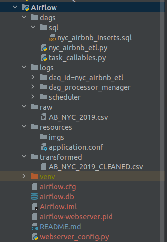
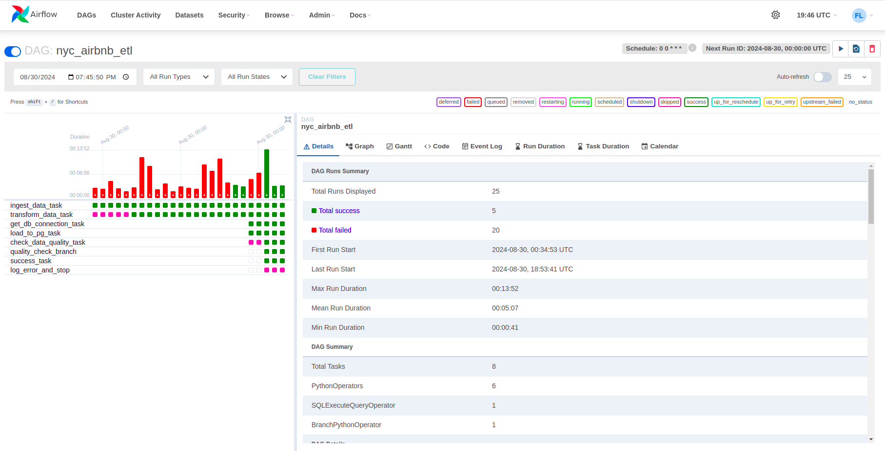
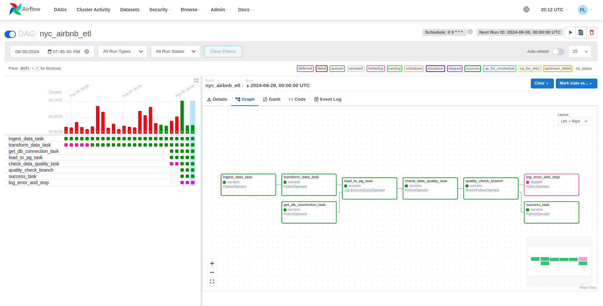
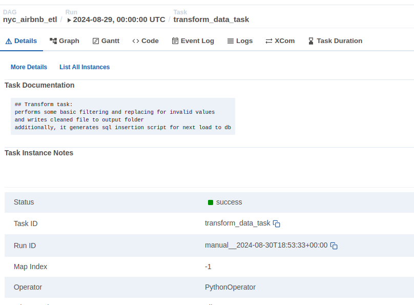
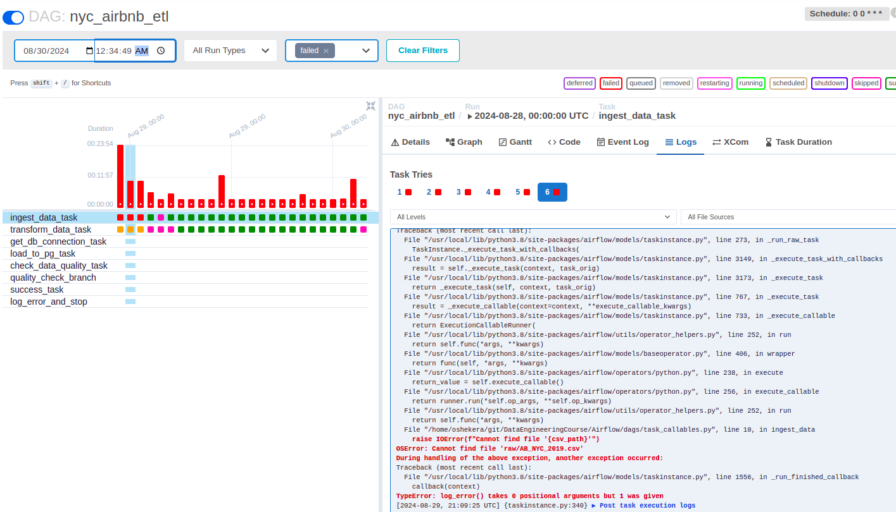
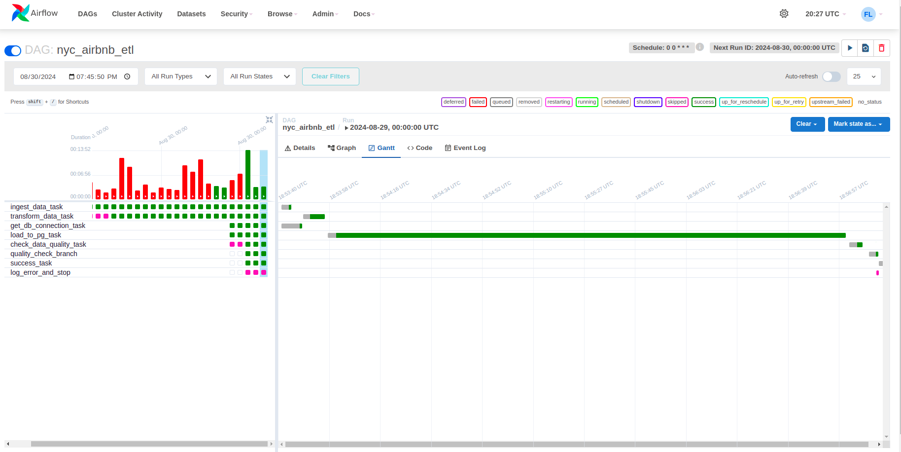

# Airflow DAG

- [1 Install and set up Apache Airflow](#1-install-and-set-up-apache-airflow)
- [2. Review nyc_airbnb_etl project structure](#2-review-nyc_airbnb_etl-project-structure)
- [3. Review nyc_airbnb_etl in UI](#3-review-nyc_airbnb_etl-in-ui)
- [4. Further optimization thoughts](#4-further-optimization-thoughts)

This README contains both general data (how I installed, set up Airflow, what problems did I have)
and the description of my DAG.

This project is a sample ETL implementation based on Apache Airflow.
It ingests a dataset from source folder, validates/filters/transforms it,
and loads to output file and to postgres database

# How to start:

## 1. Install and set up Apache Airflow
```
sudo apt-get update
sudo apt-get upgrade
```
```
sudo apt-get install python3 python3-pip
```
make sure you AIRFLOW_HOME refers to a directory with your dags, for example:
install airflow package and dependencies:
```
export AIRFLOW_HOME=/home/oshekera/git/DataEngineeringCourse/Airflow
pip install apache-airflow
pip install "apache-airflow[postgres]"
```
since Airflow uses database for users, dags, executions, etc, create the base and user for it:
```
airflow db init
airflow users create --username admin --firstname FIRST_NAME --lastname LAST_NAME --role Admin --email admin@example.com
```
they will as you to write a password for your user.
After it, run webserver and scheduler (since you'll have to do it in different terminal tabs, make sure, AIRFLOW_HOME is set for both of them):
```
airflow scheduler
```
my 8080 port is usually busy, so I run it on 9090
```
airflow webserver --port 9090
```

After it, you can login with user "admin" and your created password to admin page:
```
http://localhost:9090/
```


## 2. Review nyc_airbnb_etl project structure:

##### dags/
files with DAGs and supporting python scripts
##### dags/sql/
sql script for loading data to DB
##### logs/
airflow log
##### raw/
input csv file
##### transformed/
output csv file
##### resources/application.conf
list of input parameters. It supports environment variables, so you can run DAG from terminal with your own params
##### airflow.cfg 
a useful file with some airflow configs (like object locations, etc). you can change it.
For exmple, if you cannot see your DAG in DAG list, make sure, this dag lies under AIRFLOW_HOME/dags folder.
You can also check the path to your dag in this config file or set manually:
```
[core]
# The folder where your airflow pipelines live, most likely a
# subfolder in a code repository. This path must be absolute.
#
# Variable: AIRFLOW__CORE__DAGS_FOLDER
#
dags_folder = /home/oshekera/git/DataEngineeringCourse/Airflow/dags

.......
```

##### airflow.db
a huge file with db containgng all the airflow objects. never delete it if you don't want to lose your user, DAG objects, etc.


## 3. Review nyc_airbnb_etl in UI:
Once you chose the DAG in a list,you can see general details:
left part - previous runs (as you can see, I had a lot of failed runs :)
right up - main button like trigger execution, 
parse DAG (better to press it every time you change your DAG).



You can also click available tabs and see statistics how long did execution
take, code listing (unfortunately, only main class with DAG. 
I have some methods in another file, they are not visible here).
Also, my DAG is scheduled to run daily with CRON expression.

Another interesting tab opens when you click to some of previous executions.





Here, you can see task dependencies and results of execution for each task.
As you see, all tasks are green, and just fail-task is skipped.
By clicking to one of tasks, you can see more detailed description, documentation for it like this:





you can see logs in a special tab (one of my previous failed runs):




One more tab, I found interesting - Gantt (something similar can be found in Spark ui).
It shows execution time for each task and useful for analysis:
what task takes too long
what tasks can run in paralel, can be divided, etc:



## 4. Further optimization thoughts:
1. To decrease time on reading/writing data, we can use more intensively xcom (currently, we handle not so big dataset, but this approach can cause issues if state is large)
2. Load to DB task takes ~90% of execution time. We can try paralelyzing it - instead of one file with all queries, break all queries into multiple groups (e.g. 4-8), create for each group a separate task, and try executing in parallel.

