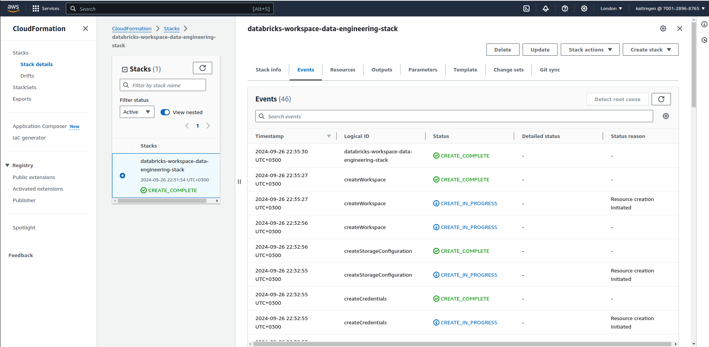
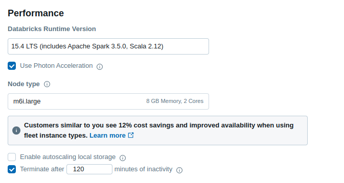
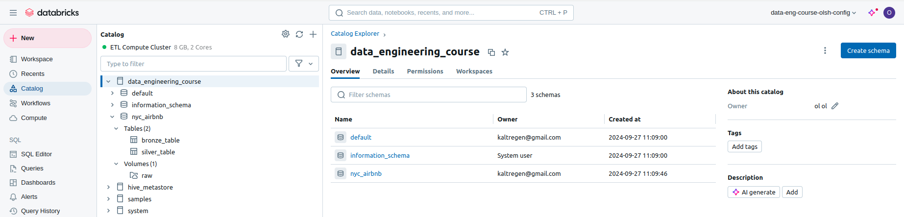
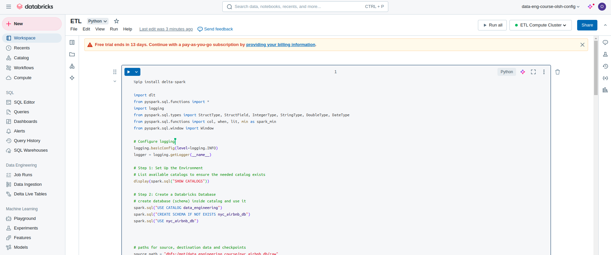
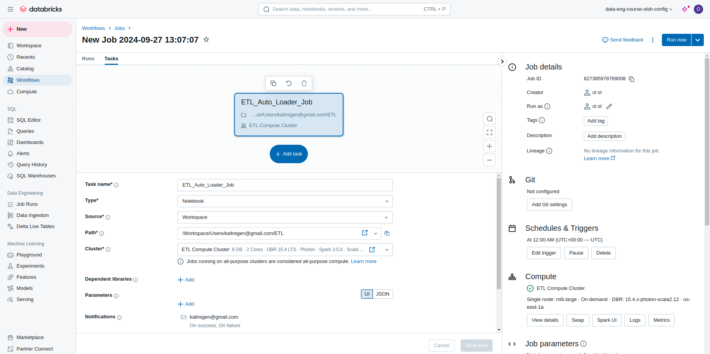
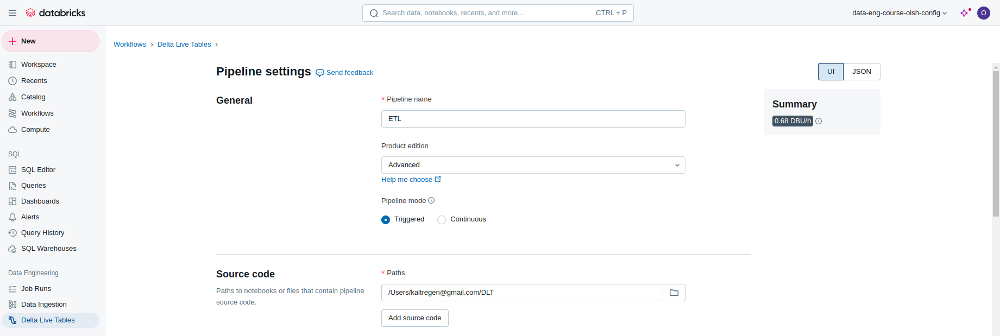
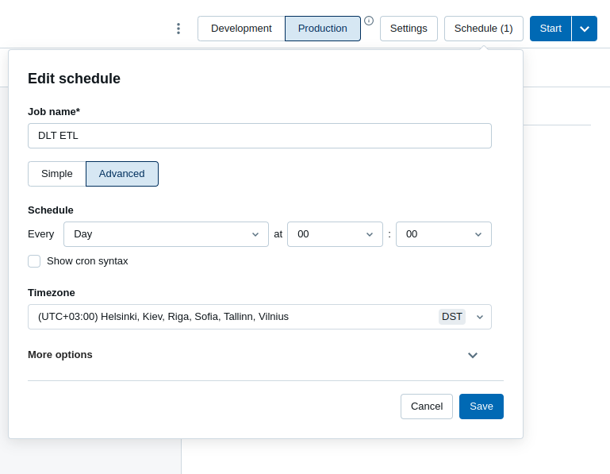

# Databricks AWS ETL

- [1. Set up and run ingestion and transformation job](#1-set-up-and-run-ingestion-and-transformation-job)
- [2. Review databricks etl project structure and files](#3-review-databricks-etl-project-structure-and-files)
- [3. Common errors and optimization thoughts](#4-common-errors-and-optimization-thoughts)

This README contains both general data (how I installed, set up Databricks, how solved some problems)
and the description of my ETL project.

This project is a sample ETL implementation based on Databricks.
It continuously and incrementally ingests data from storage, validates/filters/transforms it,
and loads transformed data to a special table.

## 1. Set up and run ingestion and transformation job:
1. Register databricks account.
2. Create a workspace from main menu. It will ask you also you create an AWS CloudFormation stack on the linked account. You can set more sensitive configs or choose a quickstart. It will create needed S3 buckets, subnets, lambdas, etc.
   
3. Under "compute" tab, create a cluster. Please pay attention at resource/performance configs. Since there's AWS EC2 and EBS under the hood, choose configs for save budget and not go over limits. Also, don't create too many unused clusters.
   
4. Go to "catalogs". There you'll probably see already existing catalog ```data_engineering_course```. Create a database (schema) ```nyc_airbnb``` under it.
   Under the database, create a volume - ```raw``` (where you'll send CSV files), and 2 tables - ```bronze_table``` and ```silver_table``` (you can find a script for it in ```tables.sql```). 
   - IMPORTANT: columns for bronze and silver table have a small difference since we change type of one column. 
   
   So, the overall structure of catalog should be like this:
   
5. Go to ```Workspaces``` and create a Notebook there. Paste code from file ```ETL-with-databricks-auto-loader.py``` (the content of it will be covered in the next section):
   
6. Since this notebook contains script namely for working with ```Databricks Auto Loader``` (not DLT), we can schedule execution of our Notebook with a job.
Here is my configuration for the job. 

IMPORTANT: Please note several points in this configuration:
   - Libraries/dependencies (delta-spark) are not included because they are already written in Notebook. On the one hand, it increases execution time, on the other - Notebook is responsible for its dependencies is easier to be reused by other jobs.
   - Task is just one because all is in the same script
   - Notifications: I set sending automatic notifications to my mail on success/failure result
   - Scheduling: I scheduled it to run daily, at 00:00:00
   - Cluster: I set it to run on previously created small cluster
   

7. Create a new Notebook from code in file ```ETL-with-DLT-pipeline.py``` and create a pipeline under ```Delta Live Tables```.

IMPORTANT:
   - It is also possible to schedule it, send notifications, all is the same as with Jobs

   - Choose appropriate Worked/Driver type in configs! (see next section)


## 2. Review databricks etl project structure and files:
Cloud components of this project are (their details and configurations are described in the previous section):
- Databricks account with: 
  - workspace with 2 python script notebooks for ```auto-loader``` and ```DLT``` pipelines
  - cluster ```ETL Compute Cluster```
  - catalog ```data_engineering_course``` with database ```nyc_airbnb```, volume ```raw```, and tables ```bronze_table``` and ```silver_table```
  - job ```ETL auto loader job``` as just a scheduled version of ```auto-loader``` notebook
  - dlt job ```DLT ETL``` build on base of ```DLT``` notebook
- AWS account with CloudFormation stack (includes S3 buckets, EBS, VPC, networks/subnets, etc). For example, databricks cluster is based on AWS EC2, catalogs/databases/tables/volumes - keys in S3 buckets
   


##### File structure:

###### - ETL-with-databricks-auto-loader.py
contains the whole which:
   - creates DB if absent
   - creates stream from raw (where you put files for ingestion) to bronze and silver table
   - contains checks - constraints on silver table
   - contains code for ```Delta Lake Time Travel```
   - contains error handling
   - covered by comments


###### - tables.sql
contains SQL scripts for creating bronze table and silver table


###### - ETL-with-DLT-pipeline.py
contains description of bronze/silver tables for DLT pipeline + constraints for silver table

###### - README.md with imgs folder


## 4. Common errors and optimization thoughts:
Most of problems which I saw, were about resources:
1. A lot of resource problems on AWS for Databricks. Even if I chose quickstart and didn't create all the needed AWS resources by myself, I still spend ~$20 just in one night of developing/testing.
2. Instance templates for cluster/job creations are very big and not suitable just for testing (minimum size - class LARGE and  2 Cores / 8 CPUs).
3. Quite often my jobs were stuck in stage of ```Waiting for resources```. Sometimes they failed with error:

```Failure happened when talking to AWS, AWS API error code: VcpuLimitExceeded AWS error message: You have requested more vCPU capacity than your current vCPU limit of 8 allows for the instance bucket that the specified instance type belongs to. Please visit http://aws.amazon.com/contact-us/ec2-request to request an adjustment to this limit.```

I used the smalles possible workers on jobs/clustes, tried recreating workspaces, also in different AWS regions.
I noticed, that when I deleted some object, not all was completely deleted from AWS. 

3.POTENTIAL OPTIMIZATION: currently, dependencies are installed inside notebook script. This means, every time we rerun it after some inactivity state (especially when it's scheduled daily),the libraries are downloaded and installed again. This consumes more network traffic, execution time, resources, etc. Tradeoff is that if we exclude it from notebook itself, we need to add it to each job using this Notebook. So it's suitable mostly for specific Notebooks.