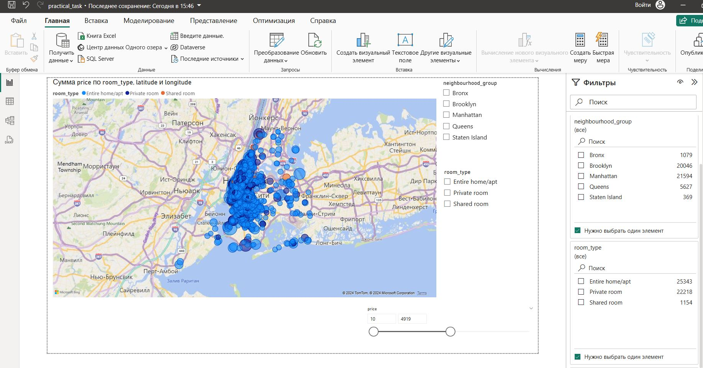
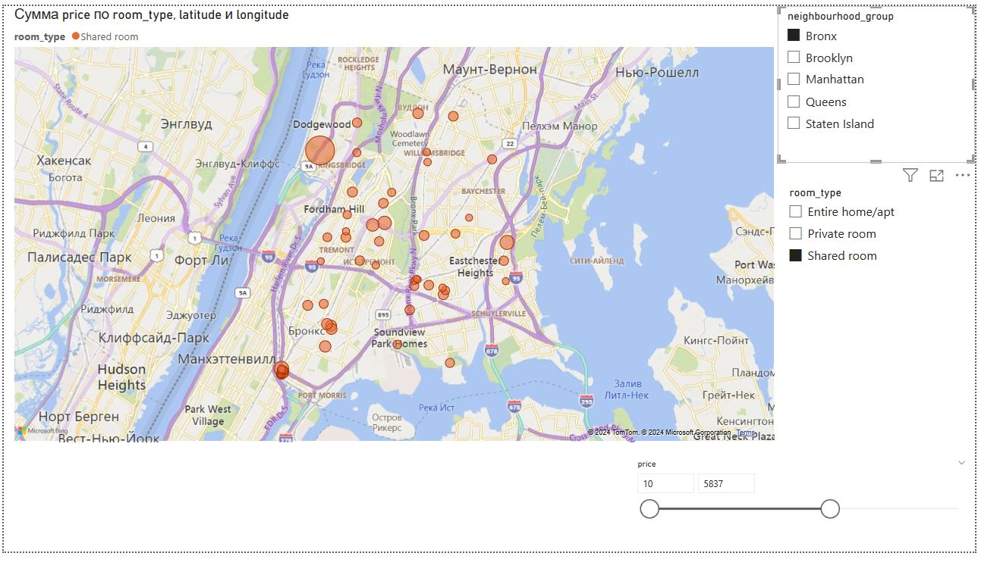
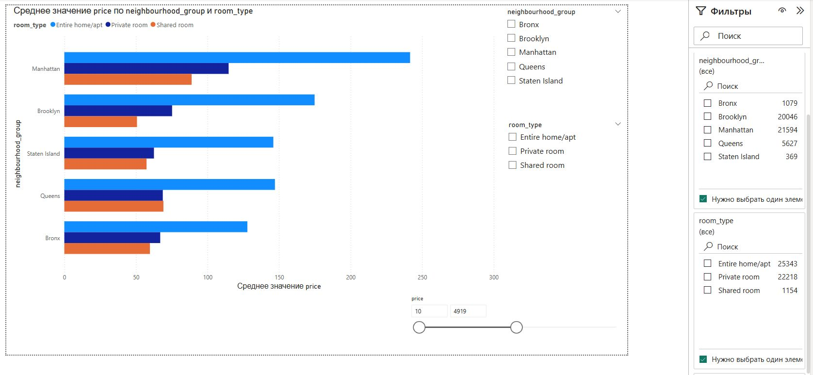
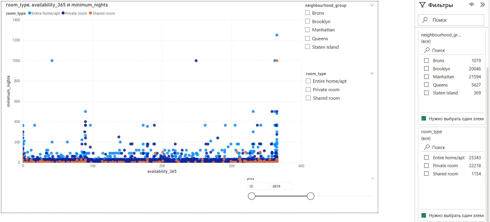
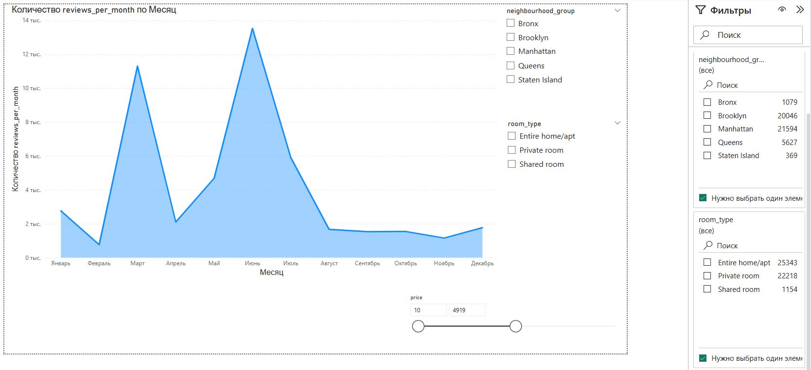
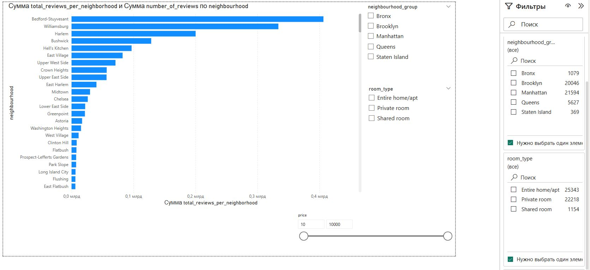
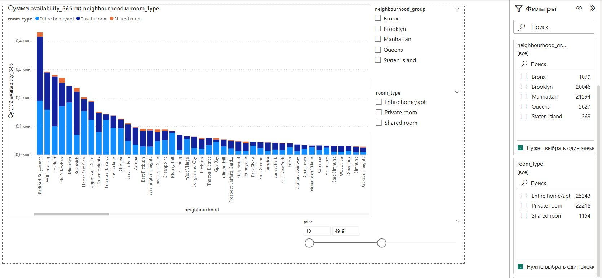
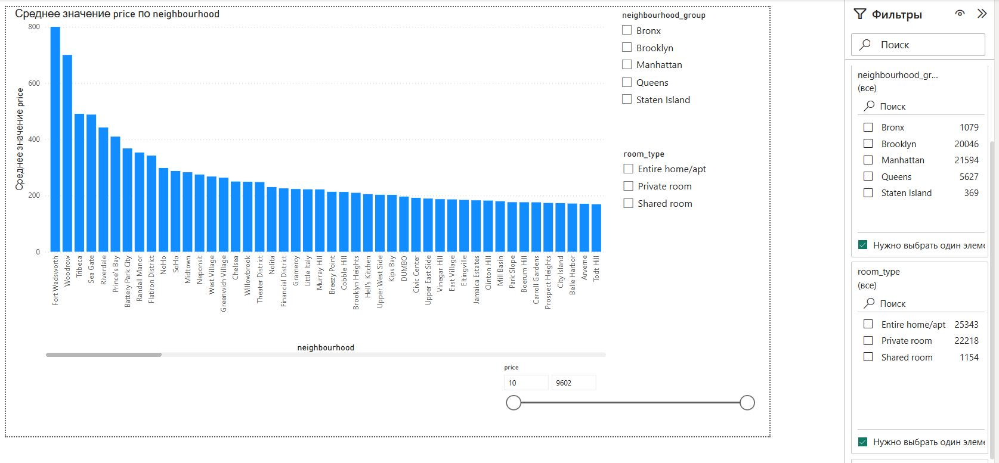

# PowerBI dataset transformations and visualizations

- [1 Set up and prepare dataset for visualization](#1-set-up-and-prepare-dataset-for-visualization)
- [2.Review visualizations](#2-review-visualizations)

This README contains both general data (how I installed, set up components, transformed file)
and the description of visualization.

This project is a sample visualizations implementation based on PowerBI.
It ingests a dataset from source local folder, validates/filters/transforms it,
and visualizates it. 

## 1. Set up and prepare dataset for visualization
1. Dowload and install PowerBI (I didn't need an account or registration for this project)
```
Important: don't repeat mistakes. I installed accidentaly russian-language version. English version will be better.
```
3. Load file AB_NYC_2019.csv as a data source. Open it in Power Query and clean with context menu.
4. Cleaned and transformed file can be found in this repo (AB_NYC_2019_cleaned.csv)
5. Transform and close this file. It will be your "database".
6. Add additionally calculated columns with DAX code:
```
average_price_per_neighborhood = 
CALCULATE(
    AVERAGE('AB_NYC_2019'[price]),
    ALLEXCEPT('AB_NYC_2019', 'AB_NYC_2019'[neighbourhood])
)

```

```
total_availability_per_neighborhood = 
CALCULATE(
    SUM('AB_NYC_2019'[availability_365]),
    ALLEXCEPT('AB_NYC_2019', 'AB_NYC_2019'[neighbourhood])
)

```

```
total_reviews_per_neighborhood = 
CALCULATE(
    SUM('AB_NYC_2019'[number_of_reviews]),
    ALLEXCEPT('AB_NYC_2019', 'AB_NYC_2019'[neighbourhood])
)

```

7. Add visualization (next chapter).

## 2. Review visualizations
1. Review visualizations:
   -  Map plot: Displays listings on a map using the latitude and longitude data. Differentiate listings by room_type or price using colors or bubble sizes.

 
 
   on this and all the next plots, there are also two options of filtering available: with visualization objects (slicers and filters as separate elements) and built-in filtering provided by PowerBI interface (right panel): 
 

 - Price Analysis:Create bar or column charts that show the average price for different neighbourhood_groups and room_type. Allow users to drill down into specific neighborhoods.

 
 
- Availability and Minimum Nights: Create a visualization that compares the availability_365 of listings with the minimum_nights required for booking.

 
  
- Reviews Over Time: Use a line or area chart to show trends in number_of_reviews or reviews_per_month over time. You can use the last_review column to track reviews over time.

 
 
- Total Reviews per Neighborhood: Create a horizontal bar chart that shows the total number of reviews for each neighborhood. This visualization will provide insights into which neighborhoods have the most active listings based on reviews.

 
 
- Total Availability per Neighborhood: Create a stacked bar chart to show total availability for each neighborhood, segmented by room_type. This will help analyze which neighborhoods have the highest availability and for which type of room.


 
 
- Average Price per Neighborhood: Create a bar chart to show the average price for each neighborhood. This visualization will help analyze which neighborhoods are the most expensive.

 
