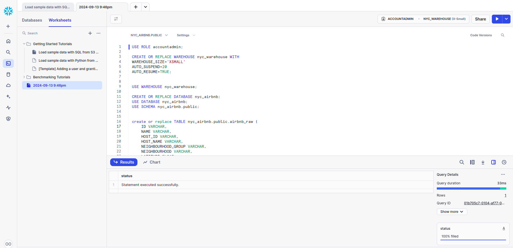
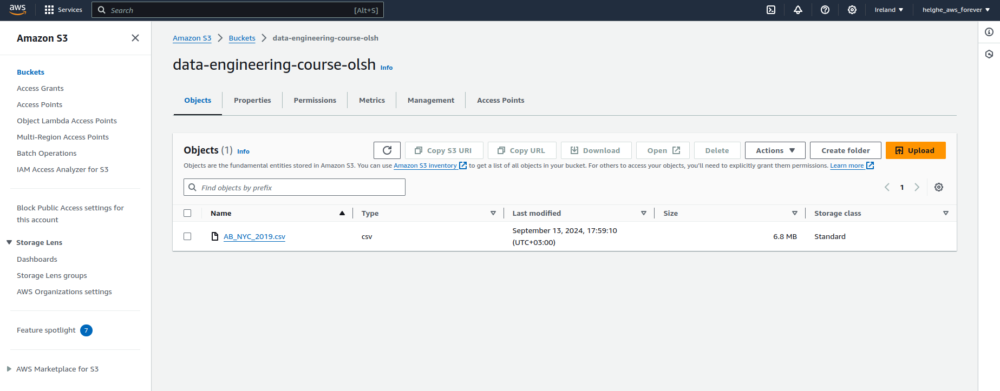
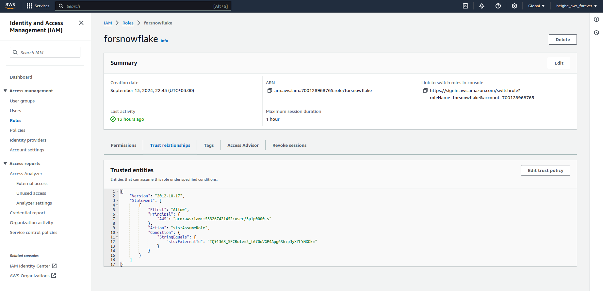
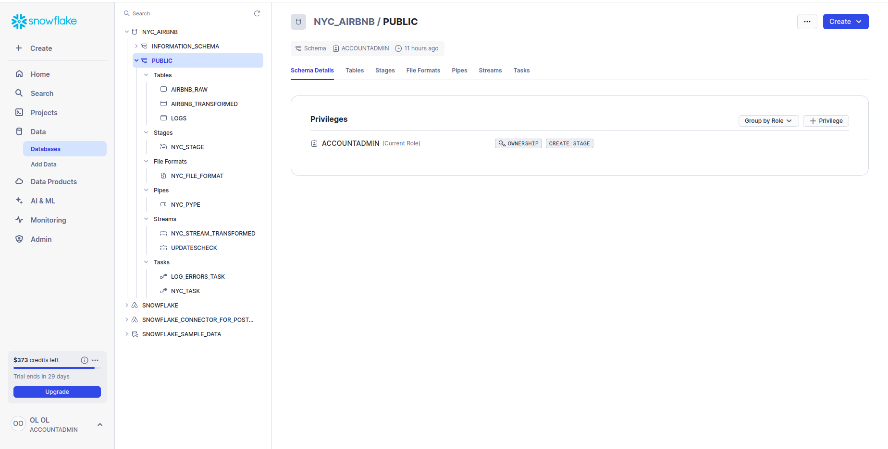
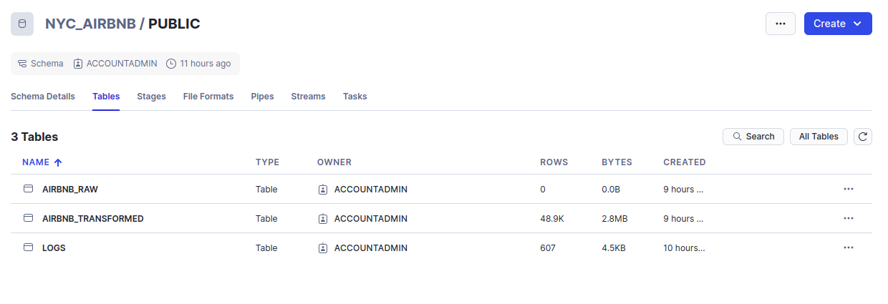
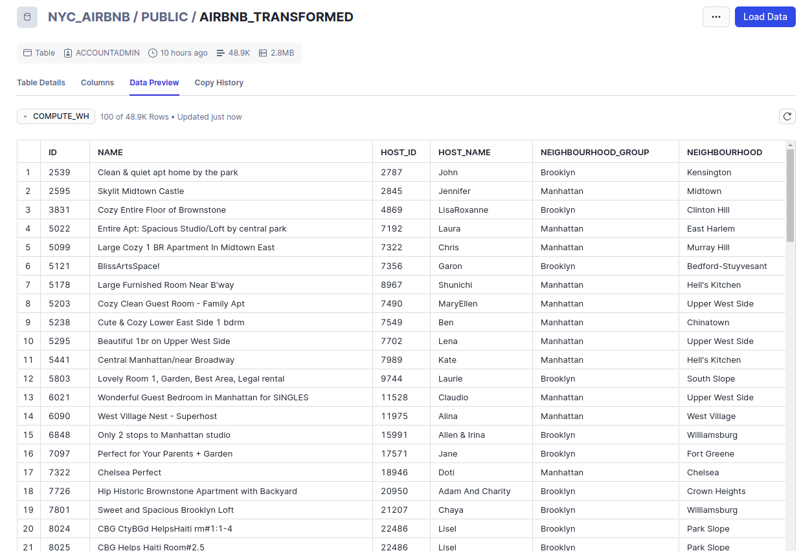
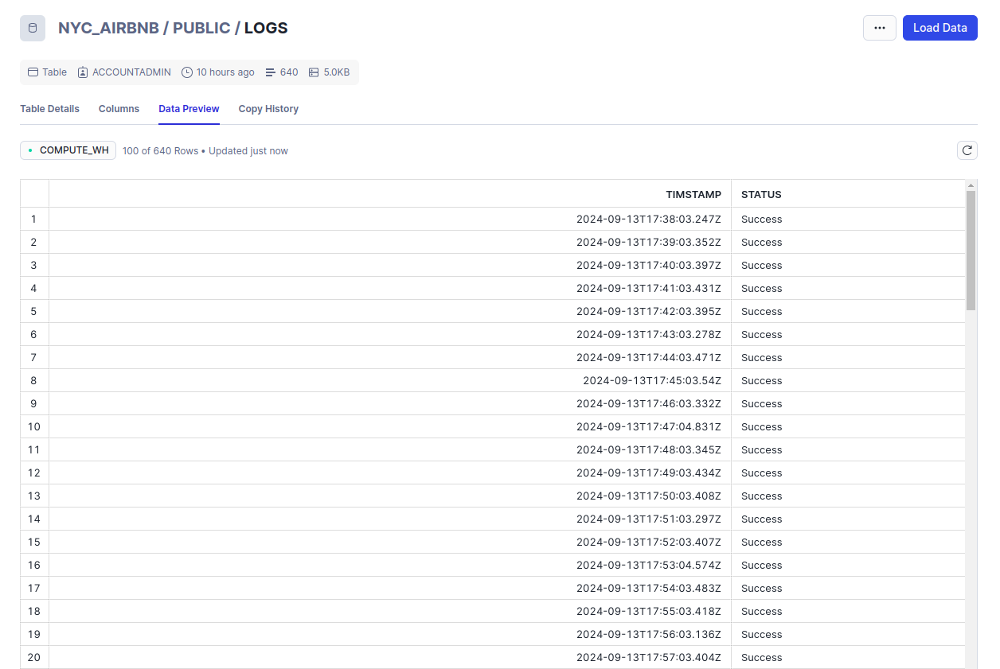
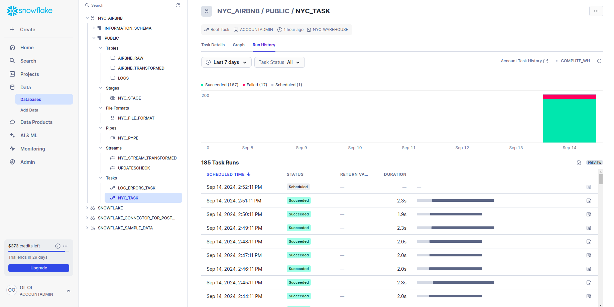

# Snowflake ETL

- [1  Initial steps to work with Snowflake](#1-initial-steps-to-run-snowflake-etl)
- [2. Review snowflake etl project files](#2-review-snowflake-etl-project-files)
- [3. Review snowflake etl project structure](#3-review-snowflake-etl-project-structure)
- [4. Further optimization thoughts](#4-further-optimization-thoughts)

This README contains both general data (how I installed, set up Snowflake, what problems did I have)
and the description of my ETL project.

This project is a sample ETL implementation based on Snowflake.
It continuously and incrementally ingests data from S3 bucket, validates/filters/transforms it,
and loads transformed data to a special table.


## 1. Initial steps to run snowflake etl
1. create snowflake trial account (please note, that Ukraine is not currently supported as your current country location)


2. create a worksheet and copy code from ```practical_task.sql``` file. It contains the scrip for creating all the needed objects (tables, integration, pipes, tasks, streams):



3. you can execute all together or each statement one by one (the second option is more preferable since it requires some small editing, see next steps)


4. go to AWS console and create s3 bucket for ingestion. ALso, you need an SQS queue to follow all the changes from this bucket. Put AB_NYC_2019.csv file in the root of this bucket.
Please don't mess up with regions. I used ```eu-west-1 Ireland```, also mentioned it during registration of Snowflake account.  
   


5. also, in AWS console, create policy and role for Snowflake. It's a tricky moment, has a couple of difficulties:
 - you need firstly to create policy and role with some dummy account id, after create integration, than use command ```DESC INTEGRATION nyc_integration;``` to see what aws credentials/accountId are used by snowflake, and edit your policy to give access to this account. A good step-by-step explanation can be found here: https://medium.com/snowflake/2024-snowpipe-auto-ingest-via-sns-sqs-a-definitive-guide-with-all-controls-c7eb21fac777 or in official documentation: https://docs.snowflake.com/en/user-guide/data-load-snowpipe-auto-s3 .
 - another difficulty - after ~1h this snowflake account can expire, and you will need to reassign new account id or configure ttl for it.
   


6. now, you are able to execute all statements from worksheet from (2) successfully.


## 2. Review snowflake etl project files:
it's very simple:
##### - practical_task.sql
contains the script to create all the needed objects: tables, integration, pipe, tasks, schema, etc.


##### PLEASE NOTE: 
sql scripts for data transformation are not very difficult, so are located inside snowflake tasks ```nyc_task``` and ```log_errors_task```


##### - README.md with imgs folder


## 3. Review snowflake etl project structure:
After you ran the script from (1.2), you'll see in snowflake ui all the created objects:

 - Database:

all is located under the same database ```NYC_AIRBNB```, under ```PUBLIC``` schema.

 - Warehouse:

all is executed on  ```nyc_warehouse``` (see configs from script)

  - Tables:

      there are 3 tables:
    

    - ```airbnb_raw``` - temporarily stores all newly added data. new data is coming here from S3 bucket via pipe ```nyc_pipe```. On snowflake side, updates in this table are detected with stream ```updatescheck``` and fetched with task ```nyc_task``` to table ```airbnb_transformed```. After it, all data from current table is cleaned up, and the table remains empty till new files in s3 bucket are added.
    - ```airbnb_transformed``` - stores all historical data after clearing/transforming. Data here is inserted with task ```nyc_task```. At the same time, stream ```nyc_stream_transformed``` monitors updates for this table and a special task ```log_errors_task``` validates transformed data (checks critical columns).
    - ```logs``` - stores logs from validation runs. A new log is inserted there on each execution of task ```log_errors_task```. It contains execution timestamp and success/failure validation result.

in particular, here is how transformed table look like after several task runs:



and logs table:


I also added a code listing for time travel to fetch different table versions.


 - File formats:

in this project ```nyc_file_format``` is used. It is associated with stage ```nyc_stage``` and pipe ```nyc_pipe``` for reading scv data.


 - Stages:

we have ```nyc_stage```, which is needed for ingesting data from s3 bucket (described above).

- Integrations:

a special object which is used for ingestion from s3 and stores configs connecting to cloud provider, with roles/account data (described above)
We have 1 integration for s3, ```nyc_integration```, which is used by our stage ```nyc_stage```.


 - Pipes:

we have 1 pipe ```nyc_pipe``` which is reading data from s3 and writing it to table ```airbnb_raw``` with file format ```nyc_file_format```.

 - Streams:

we have 2 streams for reading updates from our raw and transformed tables: ```UPDATESCHECK``` (for raw data) and ```NYC_STREAM_TRANSFORMED``` (for transformed data validation).

 - Tasks:

we have 2 tasks, both are scheduled daily:
   - ```nyc_task``` - copies, transforms, cleans data from table ```airbnb_raw``` to table ```airbnb_transformed``` (as described above).
   - ```log_errors_task``` - periodically validates data and writes status to ```logs``` table.

Here, you can see previous task executions for ```nyc_task``` (temporarily scheduled to `1 minute` for testing purposes).
There are some successful runs, previous failed runs (red color in statistics), and upcoming scheduled run:



## 4. Further optimization thoughts:
1. Currently, to validate data on non-empty critical columns, we scan all the ```airbnb-transformed``` table. It's just table scanning, since we don't have any aggregations in validations. As a result, to decrease computing resources consuming, we can validate data only for new data which we insert. So validation step can be merged with transform step.