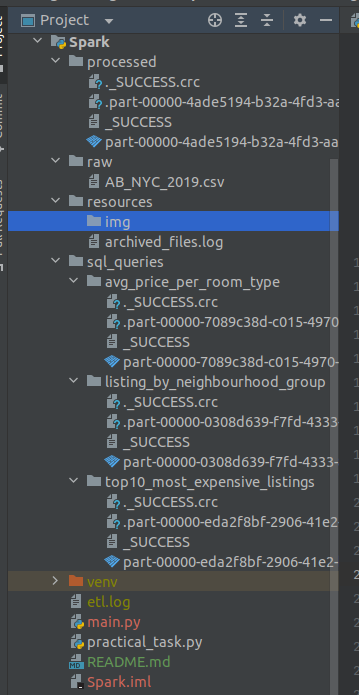
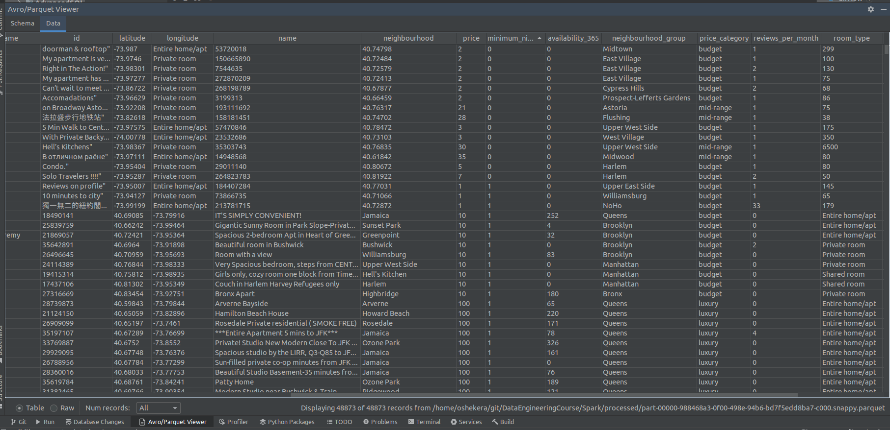
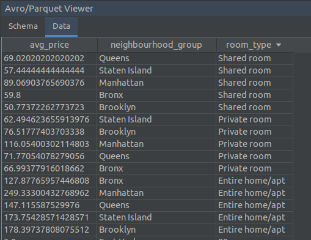
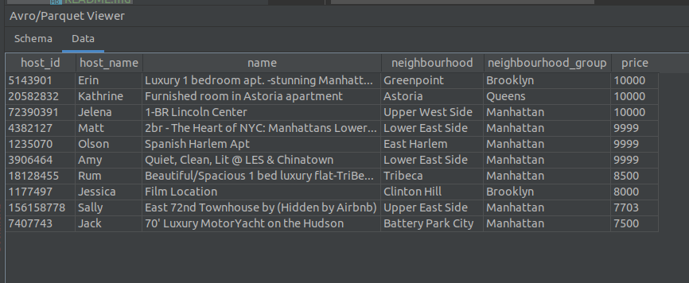
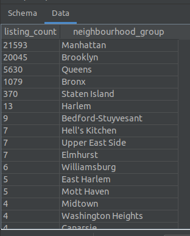

# PySpark ETL

- [1 Running PySpark ETL](#1-running-pyspark-etl)
- [2. Review pySpark ETL project structure](#2-review-pyspark-etl-project-structure)
- [3. Further optimization ideas](#3-further-optimization-ideas)

This README contains the description of PySpark ETL job.

This project is a sample ETL implementation based on Apache PySpark.
It ingests a dataset from source folder, validates/filters/transforms it,
and loads to output files


## 1. Running PySpark ETL
1. make sure file ```Spark/resources/archived_files.log``` is empty 
2. put your source data (csv files) to folder ```Spark/raw```
3. run python the script ```Spark/practical_task.py```
4. enjoy results under ```Spark/processed``` folder


## 2. Review pySpark ETL project structure:


##### raw/

contains source csv files. you can add as many as you want, and even while running the pipeline.
there are only 2 rules:
1. they should have the same schema
2. by default, pipeline will not process the same source file twice, even in different runs (but if you need to, it can be easily configured)

##### resources/archived_files.log

after each run, pipeline writes there all the paths for files which were already successfully processed.
this helps to avoid redundant processing, possible inconsistencies (although, duplicates are filtered out during processing).
here is a sample content:

```
file:///home/oshekera/git/DataEngineeringCourse/Spark/raw/AB_NYC_2019_part1.csv
file:///home/oshekera/git/DataEngineeringCourse/Spark/raw/AB_NYC_2019_part2.csv
file:///home/oshekera/git/DataEngineeringCourse/Spark/raw/AB_NYC_2019_part3.csv

```
if you need to reprocess any of archived files, just delete its name from this list.


##### processed/
contains resulted data in PARQUET format.
Here is the sample processed output (received after handling input AB_NYC_2019.csv):

please note, that all the important columns like ```price```, ```minimum_nights_available```, ```availability_365``` have all non-empty values.


##### sql_queries/
results for spark sql queries are located here as separate PARQUET files under corresponding directories:
- average price per room type and neighbourhood group
  


- top 10 listings by price
  


- listing counts for each neighbourhood group
  


## 3. Further optimization ideas:
1. Currently, even if the archived files are discarded (not handled), they as still streamed as a source, since pySpark readStream reads all the files in the folder. At the same time, we cannot use negative regular expressions in structured streaming regex. To solve this, we can filter out processed/archive files (e.g. move to a separate folder, or rename them with some pattern).
2. We can experiment with batch sizes and grouping to find the most efficient (currently, each batch is a whole separate file, which might not suite to large files).
